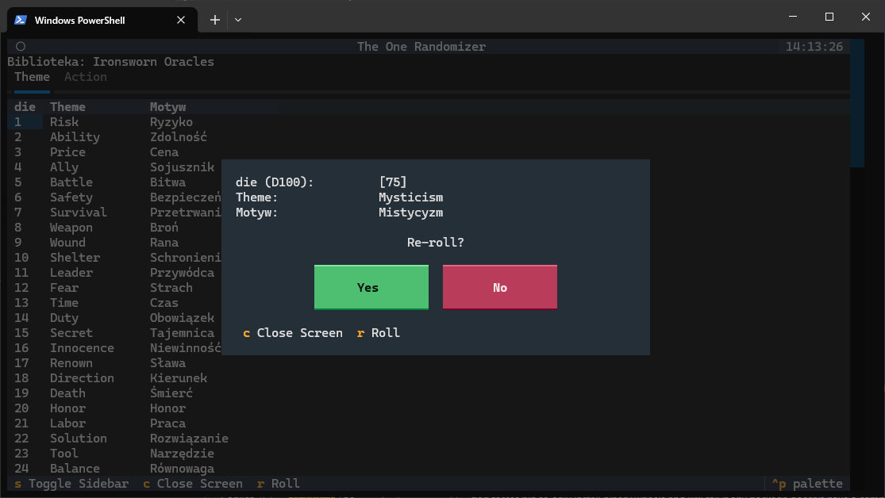

# 🎲 TOR - The One Randomizer 
Fast access to your's Random Tables

## Why

TOR was created to **speed up and simplify rolling on random tables** used in tabletop role-playing games – such as events, encounters, locations, or NPC descriptions.

Instead of flipping through spreadsheets and rolling dice by hand, you can get results **in seconds**.

It’s especially useful for:

- Solo players  
- Game Masters 

to event-driven campaigns with lots of random events  

You can use **ready-made tables** or **create your own**, and organize them exactly the way you need:
by campaign, by session, by theme, or by rulebook.

The goal is simple:  
**Less search, fast roll, fewer interruptions, more time to play, more immersion.**

---

## How

The app runs in a **clean, text-based terminal interface (TUI)**. 

1. You create **libraries** (collections of tables)  
2. You add **your own or pre-made tables**  
3. You group them however you like:
   - by campaign  
   - by session  
   - by theme (horror, fantasy, sci-fi)  
   - by sourcebook or ruleset  

Then:

4. Select a library and a table  
5. Press a key to roll  
6. Instantly see the result in a pop-up window 

## What You Get

- **TUI application to support _you_ in of play ttRPG:**
  - lightweight
  - simple and easy UI 
  - controlled by mouse or/and keyboard

- **App to manage table libraries**  
  - campaigns  
  - sessions  
  - themes  
  - rulebooks  

- **Support for custom and ready-made tables**  
- **Tabbed table browsing**  
- **One-key rolling**  
- **Result window with:**
  - rolled values  
  - full row data  
  - a “Re-roll” option  

- **Keyboard shortcuts**
  - `r` – roll  
  - `s` – toggle sidebar  
  - `c` – close window  

- **Expandable system**
  - add new libraries  
  - add new tables  
 ---

## Licenses

### Code
The source code is licensed under the MIT License.

### RPG Content
The content of random tables in `data/tables.xlsx` are based on material from:

- Ironsworn and the official Ironsworn assets Copyright ©2019 Shawn Tomkin and used under the Creative Commons Attribution-NonCommercial-ShareAlike 4.0 International license.

> ### Note:
> This is a fan utility to help with solo or tabletop play. It is not affiliated with or endorsed by any game publisher. Check the original content licenses for the tables you use.
